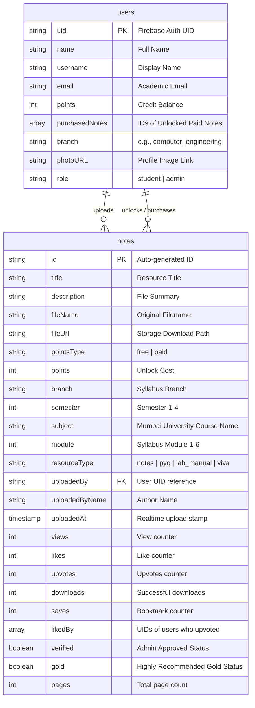

# 🚀 PrepStack – The Verified SLRTCE Resource Hub

PrepStack is a premium, centralized, and structured academic resource platform built specifically for engineering students under **Mumbai University**. By digitizing the note-sharing ecosystem, it converts scattered study resources into a highly organized, peer-reviewed, and merit-driven academic hub.

---

### 📊 Repository Badges
[](file:///c:/Users/ANAMIKA/OneDrive/Desktop/New%20folder/PrepStack/LICENSE)
[](https://react.dev/)
[](https://vite.dev/)
[](https://firebase.google.com/)
[](https://tailwindcss.com/)
[](https://www.framer.com/motion/)

---

## 🎯 The Problem & Our Solution

### The Chaos (Problem)
Engineering students lose precious preparation hours searching for study resources. High-quality handwritten notes, previous year question papers (PYQs), and laboratory manuals are:
* **Scattered** across chaotic WhatsApp chats and telegram groups.
* **Buried** inside unorganized and broken Google Drive links.
* **Unverified**, resulting in outdated, duplicate, or incorrect exam materials.
* **Low-Incentive**, giving top students zero motivation to share their curated work.

### The PrepStack Ecosystem (Solution)
PrepStack resolves this by offering:
* ✔ **Subject-Wise Categorized Repository**: Instantly filterable by Department, Semester, and Subject.
* ✔ **Verified Academic Content**: A strict moderation system where resources must be approved by Admins/Faculty before general release.
* ✔ **Point-Based Economy**: An engagement economy where students earn credits for sharing quality materials and spend them to access premium notes.
* ✔ **Exam Mode Toggle**: A focused exam-prep layout surfacing only high-yield resources (PYQs and cheat sheets) to save time before examinations.

---

## 📚 Table of Contents
1. [🧠 Core Features](#-core-features)
2. [🏗️ Tech Stack](#️-tech-stack)
3. [📁 Project Structure](#-project-structure)
4. [🧩 Architecture & Flow](#-architecture--flow)
5. [📊 Academic Relevance & Schema (Examiner View)](#-academic-relevance--schema-examiner-view)
   - [ER Diagram](#er-diagram)
   - [Database Schema](#database-schema)
   - [Ranking & Credit Economy Algorithm](#ranking--credit-economy-algorithm)
   - [Anti-Spam & Moderation Logic](#anti-spam--moderation-logic)
6. [🛠️ Installation & Setup](#️-installation-&-setup)
7. [💻 Usage & Commands](#-usage--commands)
8. [🤝 Contributing Guidelines](#-contributing-guidelines)
9. [📄 License](#-license)

---

## 🧠 Core Features

### 👤 1. Authentication & Role-Based Access
Secure and seamless login powered by **Firebase Authentication**. Users are classified into roles:
* **Students**: Can upload files, browse catalogs, download study resources, and like/bookmark notes.
* **Admins**: Access a dedicated control panel to moderate uploads, verify files, award badges, and manage users.

### 📂 2. Structured Resource Categories
To eliminate unstructured browsing, resources are dynamically tagged and indexed by:
* **Branch**: e.g., Computer Engineering (CMPN), Information Technology (IT)
* **Semester**: 1, 2, 3, or 4
* **Subject**: e.g., Analysis of Algorithms (AOA), DBMS, Python Programming
* **Resource Type**: Notes, PYQs, Lab Manuals, or Viva Resources
* **Module / Chapter**: Targets specific parts of the syllabus (Modules 1-6)

### ⭐ 3. Smart Note Ranking & "Gold" Badging
Notes are systematically ranked using real-time engagement data:
* Notes with high upvote ratios, views, and downloads climb to the top of the **Best Notes** tab.
* Exceptional, comprehensive materials receive the **Gold Badge** 🏅, distinguishing them with high visibility and priority ranking.

### 🏆 4. Circular Credit Economy
Incentivizes academic sharing:
* **Earning**: Students automatically earn **+10 credits** for every resource uploaded.
* **Accessing**: Authors can set notes as "Free" or "Paid" (with a credit cost).
* **Unlocking**: Other students spend their earned credits to unlock paid notes, transferring points directly to the author.

### 🧪 5. Exam Mode (Focused Prep)
Activating **Exam Mode** transforms the dashboard into a streamlined environment:
* Filters out long-form research and focus-intensive manuals.
* Surfaces top-rated files, vital PYQs, and high-impact cheat sheets.
* Reduces cognitive fatigue for students cramming under exam pressure.

### 🧪 6. Lab Manual & Code Repository
A dedicated section designed to assist students with practical file submissions:
* Houses verified practical lab code, circuit diagrams, and procedure summaries.
* Includes dynamic viva question sheets to prepare students for external examinations.

---

## 🏗️ Tech Stack

| Technology | Layer / Purpose | Description |
| :--- | :--- | :--- |
| **React (v19)** | Frontend Library | Component-driven UI framework with concurrent loading. |
| **Vite (v8)** | Build Tool & Bundler | High-speed hot module replacement (HMR) and compiling. |
| **Tailwind CSS (v3)** | Styling System | Utility-first responsive CSS styling with HSL color palettes. |
| **Framer Motion** | UI Animations | Fluid screen transitions, drag gestures, and micro-interactions. |
| **Firebase Auth** | Security & Auth | Secure student registration, logins, and session management. |
| **Cloud Firestore** | NoSQL Database | Real-time database storing student points, notes, and purchases. |
| **Firebase Storage** | Cloud Storage | Secure repository for hosting academic documents (PDFs, Docx). |
| **Lucide React** | Icon System | Clean, lightweight, vector-based UI iconography. |

---

## 📁 Project Structure

```
PrepStack/
├── public/                       # Static public assets
│   └── favicon.ico
├── src/
│   ├── assets/                   # Lottie animations and media files
│   ├── components/
│   │   └── student/              # Student-facing modular layouts
│   │       ├── BestNotes.jsx     # Smart note marketplace & paid unlock system
│   │       ├── ExamMode.jsx      # High-yield resource view
│   │       ├── LabManual.jsx     # Lab experiments, manual procedures, and code
│   │       ├── MyNotes.jsx       # Personal uploads manager & uploading form
│   │       ├── PYQs.jsx          # Mumbai University Question Papers
│   │       ├── Saved.jsx         # Bookmarked academic resources
│   │       ├── Setting.jsx       # Student profile & settings view
│   │       ├── Sidebar.jsx       # Dashboard sidebar navigation
│   │       ├── TopRated.jsx      # Leaderboard for student contributors
│   │       └── VivaResources.jsx # Viva question-and-answer preparation sheets
│   ├── pages/
│   │   ├── AdminDashboard.jsx    # Resource moderation & status verification console
│   │   ├── Login.jsx             # Beautiful secure animated landing & entry portal
│   │   └── StudentDashboard.jsx  # Primary student interactive workspace
│   ├── styles/                   # Global style configurations
│   │   ├── App.css
│   │   └── index.css
│   ├── App.jsx                   # Central React Router layout and redirect rules
│   ├── firebase.js               # Firebase Client initialization (Auth, Firestore, Storage)
│   └── main.jsx                  # Virtual DOM entrypoint
├── tailwind.config.js            # Tailwind compiler specifications
├── vite.config.js                # Vite build and port config
├── vercel.json                   # Cloud deployment instructions
├── eslint.config.js              # Code quality and syntax specifications
└── package.json                  # Dependencies and execution script definitions
```

---

## 🧩 Architecture & Flow

### 👤 Student Workflow
```
[Login / Registration]
         │
         ▼
[Student Dashboard] ───► [Active Point Balance]
         │
         ├─► [Browse Catalogs] ──► Filter: Branch ➔ Semester ➔ Subject ➔ Type
         │                              │
         │                              ├─► Free Resource: Read Instantly
         │                              └─► Paid Resource: Confirm ➔ Spend points ➔ Unlock
         │
         ├─► [Upload Notes] ───► Enter File Metadata ➔ Save ➔ Earn +10 points (Pending Admin View)
         │
         └─► [Engagement] ─────► Upvote helpful notes ➔ Track placement on Leaderboard
```

### 🔑 Admin Workflow
```
[Admin Login]
     │
     ▼
[Admin Dashboard Panel]
     │
     ├─► Review uploaded notes (Status: Pending verification)
     │
     ├─► Option A: Approve ➔ Tag: "✓ Verified" (visible on Best Notes)
     │
     ├─► Option B: Promote ➔ Tag: "🏅 Gold Badge" (priority listing)
     │
     └─► Option C: Delete ➔ Remove spam / duplicates (deduct credits if fraudulent)
```

---

## 📊 Academic Relevance & Schema (Examiner View)

### ER Diagram
The relationship between users and notes is illustrated below:



### Database Schema
PrepStack uses **Google Cloud Firestore** (NoSQL Document Store). Here is the relational structure:

#### Collection: `users`
*Documents represent registered users, keyed by their Firebase Auth `uid`.*

| Field Name | Data Type | Description |
| :--- | :--- | :--- |
| `uid` | `string` | Unique identifier (Document Key). |
| `name` / `username` | `string` | Display name of the user. |
| `email` | `string` | Logged-in email address. |
| `points` | `number` | Balance used in the circular credit economy. |
| `purchasedNotes` | `array [string]` | List of note IDs the user has purchased. |
| `branch` | `string` | Student's discipline (`computer_engineering`, `information_technology`). |
| `role` | `string` | Access privileges (`student` or `admin`). |

#### Collection: `notes`
*Documents represent educational files, keyed by auto-generated strings.*

| Field Name | Data Type | Description |
| :--- | :--- | :--- |
| `title` | `string` | Title of the resource. |
| `description` | `string` | Brief overview of file contents. |
| `fileName` | `string` | Original file name (e.g. `normalization.pdf`). |
| `pointsType` | `string` | Cost model: `"free"` or `"paid"`. |
| `points` | `number` | Point requirement to unlock if `"paid"`. |
| `branch` | `string` | Syllabus branch compatibility. |
| `semester` | `number` | Syllabus semester matching. |
| `subject` | `string` | Course subject matching. |
| `resourceType` | `string` | `"notes"`, `"pyq"`, `"lab_manual"`, `"viva"`. |
| `uploadedBy` | `string` | Reference to owner's `uid`. |
| `uploadedAt` | `timestamp` | Time of creation. |
| `verified` | `boolean` | Flag set to `true` when approved by admin. |
| `gold` | `boolean` | Premium high-yield item flag. |

---

### Ranking & Credit Economy Algorithm

#### 1. Circular Economy Transaction Formula
When Student $A$ clicks "Unlock Now" on a paid resource uploaded by Student $B$:
1. Let $Cost$ be the point threshold of the note (e.g., $15$ credits).
2. Validate $A.points \ge Cost$.
3. Perform a firestore transaction:
   $$A.points \leftarrow A.points - Cost$$
   $$B.points \leftarrow B.points + Cost$$
   $$A.purchasedNotes \leftarrow A.purchasedNotes \cup \{note.id\}$$
   $$note.downloads \leftarrow note.downloads + 1$$

This closes the loop: uploading premium content generates points, which are recycled to unlock other students' notes.

#### 2. Note Smart-Ranking Matrix
To keep highest quality resources on top, PrepStack surfaces and orders notes dynamically:
* **Verified Prioritization**: Notes with `verified == true` bypass standard sorting filters to occupy primary visual real estate.
* **Metric Weighting**: Ordering is computed by weighing multiple indices:
  $$\text{Engagement Score} = (\text{Upvotes} \times 3) + (\text{Downloads} \times 2) + (\text{Views} \times 0.5)$$
* **Gold Multiplier**: Notes marked `gold == true` receive a visual gold crown, custom cards, and automatically gain $+50$ points on the ranking index, placing them directly under verified elements.

---

### Anti-Spam & Moderation Logic

* **Default Isolation**: Newly uploaded files are tagged `"⏳ Pending"` (`verified = false`) and are quarantined from the default "Verified" lists to prevent spam from flooding student feeds.
* **Fraud Prevention Audit**: Admins monitor the dashboard. If a file is identified as spam, plagiarism, or unrelated:
  * The file is permanently deleted from Firestore and Cloud storage.
  * A deduction transaction is run, stripping the $+10$ points earned by the uploader.
  * Repeated spam results in user ban/block logic.
* **Syllabus Bounds Enforcement**: During the file upload step, students must select strict predefined subjects according to the Mumbai University course structures. Files containing random strings, blank uploads, or unaligned text are easily spotted on the admin console.

---

## 🛠️ Installation & Setup

Follow these steps to set up and run PrepStack locally on your computer:

### Prerequisites
Make sure you have the following installed on your machine:
* **Node.js** (v18 or higher recommended) -> [Download Node.js](https://nodejs.org/)
* **Git** version control -> [Download Git](https://git-scm.com/)

---

### Step 1: Clone the Repository
Open your terminal/command prompt and clone the repository:
```bash
git clone https://github.com/anam0505/PrepStack.git
```
Navigate into the project root directory:
```bash
cd PrepStack
```

---

### Step 2: Install Local Dependencies
Install all package dependencies defined in `package.json` using npm:
```bash
npm install
```

---

### Step 3: Configure Environment Variables
By default, the client config resides in [firebase.js](file:///c:/Users/ANAMIKA/OneDrive/Desktop/New%20folder/PrepStack/src/firebase.js). For production environments, it is recommended to set up environment variables.

Create a `.env` file in the root directory:
```bash
# On Windows PowerShell:
New-Item .env
```

Add your Firebase configuration values using Vite’s environment variable prefix (`VITE_`):
```env
VITE_FIREBASE_API_KEY=your_firebase_api_key_here
VITE_FIREBASE_AUTH_DOMAIN=your_project_id.firebaseapp.com
VITE_FIREBASE_PROJECT_ID=your_project_id
VITE_FIREBASE_STORAGE_BUCKET=your_project_id.firebasestorage.app
VITE_FIREBASE_MESSAGING_SENDER_ID=your_messaging_sender_id
VITE_FIREBASE_APP_ID=your_app_id
```

Then, you can update your `src/firebase.js` file to load these dynamically:
```javascript
const firebaseConfig = {
  apiKey: import.meta.env.VITE_FIREBASE_API_KEY,
  authDomain: import.meta.env.VITE_FIREBASE_AUTH_DOMAIN,
  projectId: import.meta.env.VITE_FIREBASE_PROJECT_ID,
  storageBucket: import.meta.env.VITE_FIREBASE_STORAGE_BUCKET,
  messagingSenderId: import.meta.env.VITE_FIREBASE_MESSAGING_SENDER_ID,
  appId: import.meta.env.VITE_FIREBASE_APP_ID
};
```

---

### Step 4: Run the Development Server
Launch the local development server:
```bash
npm run dev
```
Once compilation completes, open your browser and go to:
```
http://localhost:5173
```

---

## 💻 Usage & Commands

Use the following npm scripts to build, test, and manage the PrepStack codebase:

```bash
# Start the local development server with Hot Module Replacement (HMR)
npm run dev

# Compile the application and generate a production bundle inside /dist
npm run build

# Run ESLint to analyze static source code and check for syntax errors
npm run lint

# Preview the local production bundle in a browser environment
npm run preview
```

### Dashboard Usage Tips
1. **Login Page**: Use the login portal to register or log in. Students can register a normal account; mock administrative privileges can be toggled by configuring the user document's `role` to `'admin'` in the Firebase console.
2. **Browsing**: In the student panel, use the sidebar to choose files. Switch to the **Best Notes** tab to view files sorted by score, search by subject names, or select branch (CMPN/IT) and Sem to filter down material.
3. **Unlocked Resources**: Click **Read Now** on unlocked resources to open a beautiful, realistic, fully simulated client-side document viewer, complete with zoom adjustments and custom paging layouts.

---

## 🤝 Contributing Guidelines

We love contributions from students, faculty, and developers! To contribute code, design updates, or report issues:
1. Review the detailed guidelines in the [CONTRIBUTING.md](file:///c:/Users/ANAMIKA/OneDrive/Desktop/New%20folder/PrepStack/CONTRIBUTING.md) file.
2. Always run `npm run lint` before opening a pull request to keep code clean and uniform.
3. For major visual changes, open a Github issue to discuss concepts before executing coding work.

---

## 📄 License

This project is licensed under the MIT License. See the [LICENSE](file:///c:/Users/ANAMIKA/OneDrive/Desktop/New%20folder/PrepStack/LICENSE) file for the full text.

---

## 🚀 Future Roadmap & Features
* 🧠 **AI Exam Question Generator**: Analyzes uploaded syllabus files to generate automatic mock examinations.
* 🛡️ **Plagiarism Checker**: Scans student uploads to block copy-pasted web documents and textbook material.
* 💬 **Real-time Collaboration Sheets**: Live chat integration inside subjects to allow peer studying.
* 📱 **Native Mobile Client**: An iOS/Android companion app to enable offline note saving.
